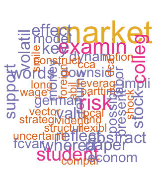

[](http://quantlet.de/)

## [](http://quantlet.de/) **Smart_Data_Analytics** [](http://quantlet.de/)

```yaml

Name of Quantlet : Smart_Data_Analytics

Published in : Teaching Materials

Description : 'Extract text data of Abstracts from SFB website and explore the abstracts, draw
words cloud.'

Keywords : data visualisation, distribution, plot, simulation, distribution

Author : Linxi Wang, Nikoleta Kovachka

Submitted : Tue, November 16 2016 by Linxi Wang

```




### R Code:
```r
rm(list = ls())
library(RCurl)
library(XML)
library(bitops)
library(stringr)

Number = paste("00", 1:5, sep = "")
url = paste("http://sfb649.wiwi.hu-berlin.de/fedc/DP_abstract.php?id=SFB649DP2016", 
    "-", Number, ".pdf", sep = "")
abs = lapply(url, FUN = function(x) htmlParse(x, encoding = "Latin-1"))

clean_txt = function(x) {
    cleantxt = xpathApply(x, "//body//text()
                        [not(ancestor :: script)][ not(ancestor :: style)] 
                        [not(ancestor :: noscript)] ", 
        xmlValue)
    cleantxt = paste(cleantxt, collapse = "\n")
    cleantxt = str_replace_all(cleantxt, "\n", " ")
    cleantxt = str_replace_all(cleantxt, "\r", "")
    cleantxt = str_replace_all(cleantxt, "\t", "")
    cleantxt = str_replace_all(cleantxt, "<br>", "")
    return(cleantxt)
}

cleantxt = lapply(abs, clean_txt)
vec_abs = unlist(cleantxt)


library(tm)
library(SnowballC)
abs = Corpus(VectorSource(vec_abs))
abs_dtm = DocumentTermMatrix(abs, control = list(stemming = TRUE, stopwords = TRUE, 
    minWordLength = 3, removeNumbers = TRUE, removePunctuation = TRUE))

dim(abs_dtm)
inspect(abs_dtm)


library(ggplot2)
library(wordcloud)

freq = colSums(as.matrix(abs_dtm))
wf = data.frame(word = names(freq), freq = freq)
plot = ggplot(subset(wf, freq > 15), aes(word, freq))
plot = plot + geom_bar(stat = "identity")
plot = plot + theme(axis.text.x = element_text(angle = 45, hjust = 1))
plot

dtms = removeSparseTerms(abs_dtm, 0.15)
freq = colSums(as.matrix(abs_dtm))
dark2 = brewer.pal(6, "Dark2")
wordcloud(names(freq), freq, max.words = 100, rot.per = 0.2, colors = dark2)


library(ggplot2)
freq <- colSums(as.matrix(abs_dtm))
length(freq)
ord <- order(freq)
m <- as.matrix(abs_dtm)
dim(m)

wf = data.frame(word = names(freq), freq = freq)
p = ggplot(subset(wf, freq > 15), aes(word, freq))
p = p + geom_bar(stat = "identity")
p = p + theme(axis.text.x = element_text(angle = 45, hjust = 1))
p

### Word Clouds First load the package that makes word clouds in R.

library(rvest)
library(xml2)
library(tidyr)
devtools::install_github("rstudio/leaflet")
library("leaflet")
library(dplyr)
library(rvest)
library(leaflet)
library(RColorBrewer)
library(magrittr)

library(wordcloud)
# Prepare the data (max 15% empty space)
dtms <- removeSparseTerms(abs_dtm, 0.15)
# Find word frequencies
freq <- colSums(as.matrix(abs_dtm))
dark2 <- brewer.pal(6, "Dark2")
wordcloud(names(freq), freq, max.words = 100, rot.per = 0.2, colors = dark2)


```
